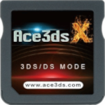
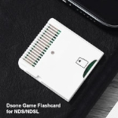
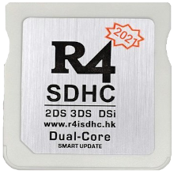
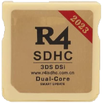
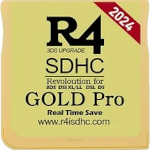
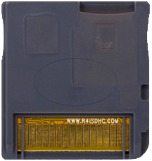
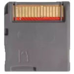

**Disclaimer**: The information contained in this post is based on other posts and forums around the web. r/flashcarts, its members, and wiki contributors do not claim to own all of these flashcarts.

Here are the best DS flashcarts available on the market currently. **If you're looking for a GBA flashcart, see the [GBA quick start guide](/r/flashcarts/wiki/gba-quick-start-guide).** For other consoles, see the [quick start guide list](https://www.reddit.com/r/flashcarts/wiki/index#wiki_quick_start_guides.3A).

## READ FIRST
1. There are hundreds, if not thousands of R4 clones made, be wary when purchasing and don't simply slap on any kernel and expect it to work.
1. Do not use 'R4' websites for purchasing flashcarts. Many are scammy and dont refund orders. Stick to more general places like eBay or AliExpress.
   - Amazon is also not generally recommended as flashcarts are generally extremely over priced compared to eBay and AliExpress.
1. Do not follow YouTube guides strictly, as there are many reproduction carts in the market and 99% of guides are outdated.
1. Need to identify your cart? [Here's a handy guide](https://www.reddit.com/r/flashcarts/comments/rdl55f/things_i_look_at_when_i_identify_flashcarts/)!
1. Need firmware? Refer to the [DS-Homebrew flashcard archive](https://flashcard-archive.ds-homebrew.com). Here you can compare the website listed on your flashcart to find the correct kernel for you. Feel free to comment or make a new post if you have trouble identifying your cart!
1. Want to install YSMenu and not worry about timebombs? Refer to the [gbatemp.net thread](https://gbatemp.net/threads/retrogamefan-updates-releases.267243/). **Not all carts are compatible with YSMenu!** If you are unsure, ask before you install. You risk bricking your cart with the wrong firmware!
1. Do **not** buy a flashcart with a pre-loaded SD card. These SD cards are very cheap and will usually die on you within weeks. You will **not** be able to recover the files stored on them. Save yourself the hassle and buy a microSD card separately, being [cautious of SD card scams](https://www.youtube.com/watch?v=mSepkrHJv14).
1. **Note that GBA emulation on these consoles is not perfect, refer to the [GBARunner2 Wiki](https://wiki.gbatemp.net/wiki/GBARunner2#DS_Compatibility_List) to check game compatibility.**
1. **None of the carts listed here play 3DS games. Install CFW to run 3DS games, more details in the [3DS section](#wiki_3ds).**

## Recommended carts
### Ace3DS X

The Ace3DS X is a version of the Ace3DS+ (seen down this list) that also supports ntrboot with just a flick of a switch.

ntrboot is a method that allows you to fix a bricked 3DS family console, and the Ace3DS X makes ntrboot very easily accessible without any modification required such as flashing the cartridge! 

For general usage outside of unbricking, Ace3DS X clones are a good cheap option, however they have a few downsides. Due to iffy shell quality some report that it doesn't fit well into their consoles. It also runs an older version of Wood which lacks some anti-piracy patches, so to play certain games you will have to manually [patch their ROMs](https://gbatemp.net/download/retrogamefan-nds-rom-tool-v1-0_b1215.35735/). Its biggest benefit is that it works on all DSi/3DS consoles.

This is recommended **for unhacked DSi and 3DS users** to buy, as well as people who are attempting to unbrick their console (or would like that peace of mind). Usually costs $5-10 USD. Searching "ace3ds" seems to correctly return results on Aliexpress. Some links are provided here, but they may not be the cheapest options out there: 

- aliexpress: [https://www.aliexpress.com/item/1005005337644588.html](https://www.aliexpress.com/item/1005005337644588.html) 
- nds-card: [https://www.nds-card.com/ProShow.asp?ProID=575](https://www.nds-card.com/ProShow.asp?ProID=575)

- Kernel: [Ace3DS+ Wood R4 v1.62](https://flashcard-archive.ds-homebrew.com/Ace3DS+_R4iLS/Ace3DS+_R4iLS_Wood_R4_1.62.7z)

### DSONE SDHC Clone

A clone of the SuperCard DSONE (SDHC), these carts have more or less perfect compatibility and a few features like RTS, slowdown, and an in-game menu not common on other carts. Only works on DS Phat/Lite and hacked DSi/3DS, **will not work on stock DSi/3DS**.

Has a relatively high defective cart rate, so buying two or three is recommended to ensure you get a fully functional cart. Defective carts usually still work with YSMenu, but will not be able to take advantage of the extra features provided by its usual Evolution OS kernel.

A guide to using the DSONE SDHC is here: https://github.com/Sanrax/DSOneManual

This is recommended **if you only use DS Lite/Phat**. Costs $5-10 USD. Searching "dsone" on AliExpress or eBay usually returns this cart. A link is provided here, but this may not be the cheapest option as it's one of the many listings: [https://www.aliexpress.com/item/1005002378653693.html](https://www.aliexpress.com/item/1005002378653693.html)

- Kernel: [Evolution OS](https://flashcard-archive.ds-homebrew.com/SuperCard/DSONE_SDHC_DSONEi/SuperCard_DSONE_SDHC_EOS_sp6_20121206.zip)
- Alternate kernel: [YSMenu](https://gbatemp.net/threads/retrogamefan-updates-releases.267243/) (Only use if Evolution OS gives a PSRAM error)

### Ace3DS+ Clone

These carts are a clone of the Ace3DS+ flashcart, compatible with all DS, DSi, and 3DS consoles, even unhacked on the latest firmware. These Ace3ds+ clones **do not** work with ntrboot, see the Ace3ds X instead if this is a feature that you may need.

Important distinction: past postings of unlabeled Ace3DS+ clones exist, but we can no longer advise the purchase of these carts as they have started mixing in older versions of the Ace3DS+ which do not work on the latest firmware. More confusion arises from the fact that there are also timebombed clones in the unlabeled carts. Please purchase the other variants instead, specifically of the images above.

These carts are sold under a variety of brandings. The 2020 and later carts labelled as r4isdhc**.hk** and r4isdhc**.com.cn**, and "208-in-1" carts are  Ace3DS+ clones. Aside from the distinction note above, all of these carts perform identically regardless of branding.

Note that there exist similar carts looking carts that are **not** Ace3DS+ clones, but rather [timebomb clones](#wiki_timebomb_clone). These include labelled as r4isdhc**.com** and some unlabelled red PCB carts. The notable physical differences are:

- Ace3DS+ clones have either one or five holes in the PCB near the pins, the similar timebomb clones have two
   - NOTE: It has been reported that the 5 hole PCB variant do not work on unmodded DSi/3DS consoles. This is mostly prominent on unlabeled Ace3DS+ clones, so do not purchase unlabeled carts
- Ace3DS+ clones have smaller but deeper indents on the sides
- Timebomb clones typically have an oval shaped indent in the plastic on the back
- Ace3DS+ clones always have red PCBs, timebomb clones often have yellow PCBs but are sometimes red as well

Ace3DS+ clones are a good cheap option, however they have a few downsides. Due to iffy shell quality some report that it doesn't fit well into their consoles. It also runs an older version of Wood which lacks some anti-piracy patches, so to play certain games you will have to manually [patch their ROMs](https://gbatemp.net/download/retrogamefan-nds-rom-tool-v1-0_b1215.35735/). Its biggest benefit is that it works on all DSi/3DS consoles.

This is recommended **for unhacked DSi and 3DS users** to buy. Usually costs $5-10 USD. Searching "r4 wood" on AliExpress or "r4" on eBay usually returns this cart. A link is provided here, but this may not be the cheapest option as it's one of the many listings: [https://www.aliexpress.com/item/1005003830660409.html](https://www.aliexpress.com/item/1005003830660409.html)

- Kernel: [Ace3DS+ Wood R4 v1.62](https://flashcard-archive.ds-homebrew.com/Ace3DS+_R4iLS/Ace3DS+_R4iLS_Wood_R4_1.62.7z)

### Timebomb clone

These common carts are clones of the DSTT, but with a timebomb in their official kernel. The timebomb is purely software, so switching to an alternative kernel will remove it. These carts are compatible with all DS, DSi, and 3DS consoles, even on the latest firmware, so they make a decent choice for unhacked DSi/3DS users, but the above [Ace3DS+ clones](#wiki_ace3ds+_clone) are recommended instead if possible.

Most of these carts available today are labelled as r4isdhc**.com**, others do exist. The timebomb causes the cart to stop loading NDS ROMs after a certain date, but be fixed by either switching to the YSMenu kernel or just setting back your DS clock. Ace3DS+ clones are recommended instead due to the Wood kernel having higher compatibility with certain features such as Wii connectivity in DS games.

One notable advantage of these carts over DSONE or Ace3DS+ clones is that they support ntrboot for installing CFW on a 3DS. If you are looking for a cart with ntrboot support and do NOT have a spare DS/DS Lite/hacked DSi or 3DS, then these carts are a good choice. Otherwise, consider the Ace3DS X above.

This is only recommended **if you cannot buy an Ace3DS+ clone, or want to use ntrboot and do not have a spare DS/DS Lite or a console with CFW**. Usually costs $10-15 USD. Searching "r4 gold pro" on AliExpress or eBay usually returns this cart. A link is provided here, but this may not be the cheapest option as it's one of many listings: [https://www.aliexpress.com/item/1005004530389743.html](https://www.aliexpress.com/item/1005004530389743.html)

- Kernel: [YSMenu](https://gbatemp.net/threads/retrogamefan-updates-releases.267243/)

## Non-recommended carts
These are carts that you may encounter but are not generally recommended.

- [**R4i Gold 3DS Plus**](https://i.imgur.com/QI4AYJN.jpg): This cart halted production at the start of 2020, they were formerly highly recommended but their last batch was faulty and cannot play NDS ROMs, so they are no longer recommended; do not follow old advice saying to buy them
   - This refers specifically to the *R4i Gold 3DS Plus* from r4ids.cn, they should not be confused with carts from any other website
- **[R4 DS](https://i.imgur.com/MFUcsrA.jpg)** ([gray](https://i.imgur.com/nmC9Bci.jpg), [AliExpress clone](https://i.imgur.com/eRZLFtq.jpg)): Identical (1:1) clones original R4 are available on AliExpress, however they are not recommended due to only supporting 2 GB or smaller microSD cards
   - These clones on AliExpress can be identified by their green PCB and lack of a label in a shell otherwise similar to timebomb clones

## DSi
On the DSi/DSi XL consoles, Nintendo introduced a whitelist and RSA signatures in an attempt to prevent flashcarts from functioning, so you need to be careful which flashcart you buy to use it on a DSi. Because of this the [Ace3DS+ clones](#wiki_ace3ds.2B_clone) are recommended if you choose to buy a flashcart for use on a DSi, as they are supported all the way up to the latest firmware version.

If you have an unsupported flashcart it will show black screens with white text that says "[An error has occurred](https://i.imgur.com/gE47UKA.png)" when loading. This can be bypassed by installing CFW on your DSi. Specifically Unlaunch is required, with Unlaunch you will be able to load the flashcart from the DSi Menu if it was installed with launcher patches enabled or from Unlaunch itself, TWiLight Menu++, or hiyaCFW regardless of if Unlaunch's launcher patches are enabled.

On a hacked DSi, there is also the option to play DS games using nds-bootstrap (from [TWiLight Menu++](https://wiki.ds-homebrew.com/twilightmenu/)). This allows games to be loaded from DSi's SD card without needing to purchase anything besides an SD card if you don't already have one. However, nds-bootstrap's [compatibility](https://docs.google.com/spreadsheets/d/1LRTkXOUXraTMjg1eedz_f7b5jiuyMv2x6e_jY_nyHSc/htmlview) isn't quite as good as that of flashcarts so buying a flashcart can still be worthwhile. It is generally recommended to try CFW and only buy a flashcart if you want to play a game that isn't compatible or want the portability of a flashcart, being able to share the same save files by simply moving the flashcart.

See [dsi.cfw.guide](https://dsi.cfw.guide) for how to install CFW on your DSi.

## 3DS
On the 3DS family of consoles (including the 2DS and XL variants) there is a distinction between flashcarts that play 3DS games and flashcarts that play DS games. Flashcarts that play 3DS games are rendered mostly useless by the existence of CFW, which has *better* compatibility and is completely free, while 3DS flashcarts are very expensive. CFW also has other benefits over 3DS flashcarts such as the ability to run homebrew and emulators.

Flashcarts for playing DS games on the other hand can still be useful, and everything in the [DSi](#wiki_dsi) section above applies to DS mode flashcarts on the 3DS as well. With [TWiLight Menu++](https://wiki.ds-homebrew.com/twilightmenu/installing-3ds.html) being a good option, but flashcarts for DS games having slightly higher compatibility. The [Ace3DS+ clones](#wiki_ace3ds.2B_clone) are also the recommended DS flashcart for 3DS users as they support the latest 3DS firmware without needing CFW. Any DS flashcart can be run with CFW, either from the 3DS HOME Menu or TWiLight Menu++.

See [3ds.hacks.guide](https://3ds.hacks.guide) for how to install CFW on your 3DS.
